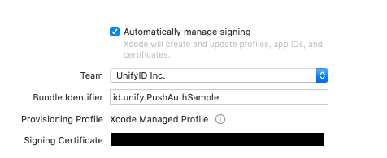
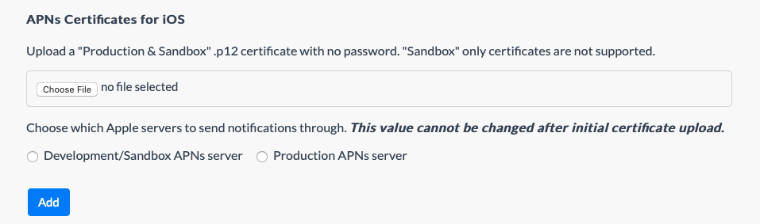
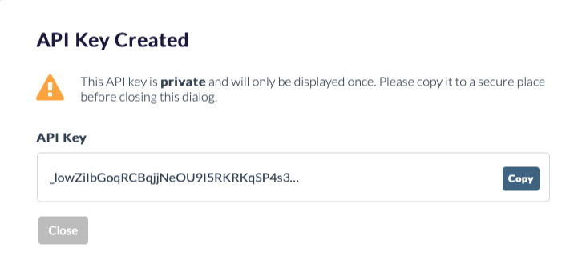

# UnifyID PushAuth Sample Project

This project holds the sample of how to integrate PushAuth into your iOS app. To run this sample, you need to:

1. Set up project's push notification
2. Set up UnifyID API and SDK key
3. Create a PushAuth session

## 1. Set up project's push notification

UnifyID's iOS PushAuth implementation relies on [Apple's Push Notification](https://developer.apple.com/notifications/). This feature is not available in iOS Simulators, hence you need an iOS device. Update the project's Signing and Capabilities configuration to use your team and app bundle ID:



Make sure your application bundle ID has Push Notification capabilities activated.

## 2. Set up UnifyID API and SDK key

Create a project in [UnifyID developer dashboard](https://dashboard.unify.id/account/sign-in). Follow [this guide](https://developer.unify.id/docs/get-started/) on how to make one.

Upload an APNS Production & Sandbox certificate, normally in a format of a `*.p12 ` file. On first upload, choose whether you will utilize the Sandbox or Production push notifications.



To run the project directly from Xcode (debug or development builds), choose **development**. To distribute it via Adhoc builds / Testflight / AppStore, choose **production**.


## 3. Create a PushAuth session

You should have a project ready in the UnifyID dashboard. Create an API key and SDK key for your project. Copy the API key value and store it somewhere safe, since it will be given only once.



Creating the SDK key require similar steps, but it will be provided in the dashboard page after its creation.

Run the app to your iPhone. Input your SDK key along with a "user" string to configure it properly. Send a PushAuth request through your macOS Terminal using this `curl` command:

```
curl -H 'accept: application/json' \
-H "x-api-key: $UNIFY_API_KEY" \
--data '{
"notification":{
  "title":"A Test Push Notification",
  "subtitle":"Lovingly sent from CURL",
  "body":"It even has a body!"
},
"user":"<session_user>"}' \
--request POST https://api.dev.unify.id/v1/push/sessions
```

The `UNIFY_API_KEY` represents the API key you have created. The `<session_user>` represents the "user" string value you inputted in the app.

Copyright © 2020 UnifyID, Inc. All rights reserved.